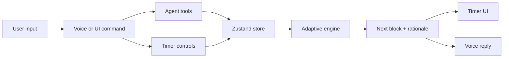

# Kai

<p align="center">
  
</p>

An adaptive focus coach with a timer, a voice loop, and an engine that changes the session length based on how the user is actually doing.

Live: https://heykai.vercel.app  
App: https://heykai.vercel.app/app

## The idea

Kai is not a 25-minute Pomodoro clone. The research behind the build showed that the useful part of Pomodoro-style work is predetermined structure and protected breaks, not a universal 25/5 interval. Kai keeps the structure, then personalizes the length.

## What it does

- Starts focus blocks and breaks from the UI or by voice.
- Uses recent focus ratings, fatigue, streak, time of day, and calendar fit to choose the next block.
- Explains each timing decision in plain English.
- Searches calendar history forward and backward so Kai can reason about past and upcoming commitments.
- Searches Gmail history, fetches individual email context, and creates or edits Gmail drafts without sending them.
- Searches the live web through a configured search provider, with a limited no-key fallback.
- Plays Spotify music by voice, searching saved tracks and playlists first and the broader Spotify catalog when the user asks for it.
- Exposes an Alexa custom-skill endpoint for next-session planning, browser timer control, and Spotify playback.
- Supports opt-in "Hey Kai" wake listening while the app tab is open.
- Shares one client-side store between the timer UI and the voice agent, so voice commands and clicks operate the same state.
- Uses a Sabi-style conversational voice loop: tap once, speak naturally, pause, get an answer.
- Presents the product as a calm visual environment, with study-room photo backgrounds, a large clock, dock controls, tasks, settings, and voice.

## Architecture



## What makes it adaptive

- Recent focus quality is the strongest signal.
- Blocks lengthen when the user is in flow and shorten when focus gets choppy.
- Breaks are protected and can grow when the user is tired.
- Time-of-day is a gentle nudge, not a hard rule.
- Long breaks trigger after focus streaks.
- Calendar fit is part of the domain model, ready for real integration.

See [`docs/RESEARCH.md`](docs/RESEARCH.md) for the verified research pass.

## Business and launch docs

- [`docs/BUSINESS_PLAN.md`](docs/BUSINESS_PLAN.md)
- [`docs/IMPLEMENTATION_PLAN.md`](docs/IMPLEMENTATION_PLAN.md)
- [`docs/ADS_AND_TESTING_RESEARCH.md`](docs/ADS_AND_TESTING_RESEARCH.md)
- [`docs/AI_MUSIC_AND_SPOTIFY_RESEARCH.md`](docs/AI_MUSIC_AND_SPOTIFY_RESEARCH.md)
- [`docs/BRAND_VISUAL_RESEARCH.md`](docs/BRAND_VISUAL_RESEARCH.md)

## Stack

Next.js, TypeScript, Zustand, Anthropic Claude, Groq Whisper route, browser audio APIs, and a custom adaptive timing engine.

## Run locally

```bash
cp .env.local.example .env.local
npm install
npm run dev
```

The timer works without an API key. The voice agent needs `ANTHROPIC_API_KEY`; the faster transcription path uses Groq when configured. Calendar uses Google Calendar OAuth envs. Gmail history/drafts need Gmail OAuth scopes. Web search uses Brave, Tavily, Serper, or Google Custom Search when configured, and otherwise falls back to DuckDuckGo Instant Answer.

Useful integration env vars:

- `GOOGLE_CALENDAR_CLIENT_ID`, `GOOGLE_CALENDAR_CLIENT_SECRET`, `GOOGLE_CALENDAR_REFRESH_TOKEN`
- `GOOGLE_GMAIL_CLIENT_ID`, `GOOGLE_GMAIL_CLIENT_SECRET`, `GOOGLE_GMAIL_REFRESH_TOKEN`
- Gmail scopes: `gmail.readonly` for history and `gmail.compose` for drafts
- `BRAVE_SEARCH_API_KEY`, `TAVILY_API_KEY`, `SERPER_API_KEY`, or `GOOGLE_SEARCH_API_KEY` plus `GOOGLE_SEARCH_ENGINE_ID`
- `SPOTIFY_CLIENT_ID`, `SPOTIFY_CLIENT_SECRET`, `SPOTIFY_REFRESH_TOKEN`
- `NEXT_PUBLIC_SITE_URL` for the canonical URL used by metadata and sitemap
- `ALEXA_SKILL_ID`, `ALEXA_VERIFY_SIGNATURES` for the custom Alexa skill webhook

See [`docs/ALEXA.md`](docs/ALEXA.md) for the Alexa Console setup and skill model.
