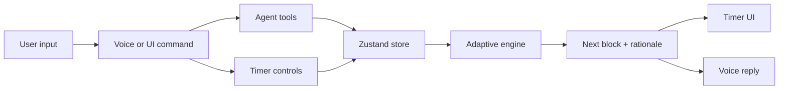

# Kai

<p align="center">
  
</p>

An adaptive focus coach with a timer, a voice loop, and an engine that changes the session length based on how the user is actually doing.

Live: https://heykai.vercel.app

## The idea

Kai is not a 25-minute Pomodoro clone. The research behind the build showed that the useful part of Pomodoro-style work is predetermined structure and protected breaks, not a universal 25/5 interval. Kai keeps the structure, then personalizes the length.

## What it does

- Starts focus blocks and breaks from the UI or by voice.
- Uses recent focus ratings, fatigue, streak, time of day, and calendar fit to choose the next block.
- Explains each timing decision in plain English.
- Shares one client-side store between the timer UI and the voice agent, so voice commands and clicks operate the same state.
- Uses a Sabi-style conversational voice loop: tap once, speak naturally, pause, get an answer.
- Presents the product as a calm visual environment, with painterly backgrounds, a large clock, dock controls, tasks, settings, and voice.

## Architecture



## What makes it adaptive

- Recent focus quality is the strongest signal.
- Blocks lengthen when the user is in flow and shorten when focus gets choppy.
- Breaks are protected and can grow when the user is tired.
- Time-of-day is a gentle nudge, not a hard rule.
- Long breaks trigger after focus streaks.
- Calendar fit is part of the domain model, ready for real integration.

See [`docs/RESEARCH.md`](docs/RESEARCH.md) for the verified research pass.

## Stack

Next.js, TypeScript, Zustand, Anthropic Claude, Groq Whisper route, browser audio APIs, and a custom adaptive timing engine.

## Run locally

```bash
cp .env.local.example .env.local
npm install
npm run dev
```

The timer works without an API key. The voice agent needs `ANTHROPIC_API_KEY`; the faster transcription path uses Groq when configured.
